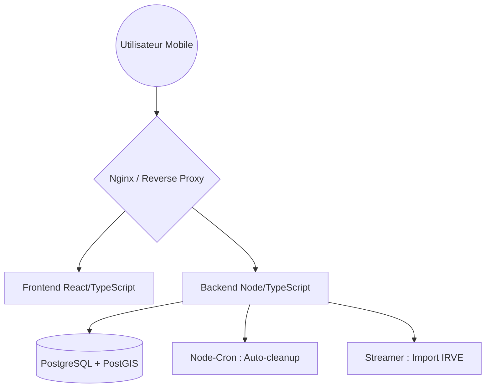

# ⚡ Watts Up | Plateforme de Réservation IRVE

  
  
  

---

## 👤 À propos de moi

Salut ! 👋 Moi, c'est **Camille Céleste Covarel**.

Développeuse Fullstack avec une spécialisation marquée en **Backend** et **DevOps**, j'ai validé mon Titre Professionnel "Développeur Web et Web Mobile" (DWWM) fin 2025 à la **Wild Code School Toulouse**.

### 🎨 Un parcours hybride : de l'image au code
Avant de plonger dans le monde du développement, j'ai évolué en tant que **graphiste** et **photographe**. Ce bagage créatif est aujourd'hui une force majeure : il m'apporte une rigueur visuelle, un œil critique sur l'UI/UX et une capacité à concevoir des interfaces aussi esthétiques que fonctionnelles.

Sur **Watts Up**, j'ai combiné ces deux mondes en tant que **Lead Tech**, **Product Owner** et **DevOps**, veillant à ce que la robustesse de l'infrastructure serve une expérience utilisateur impeccable.

> **🤝 Pourquoi ce partage ?**
> Je partage mes documents officiels pour aider les prochains candidats à visualiser les attentes du jury. *Servez-vous en pour apprendre et structurer votre projet, pas pour copier !*

---

## 🚀 Démo en ligne
Le projet est déployé et testable en live :  
👉 **[watts-up.anamnesis.ovh](https://watts-up.anamnesis.ovh/)**

---

## 🌟 Présentation du projet
**Watts Up** est une solution "Mobile First" répondant aux défis de la mobilité électrique. L'application permet de gérer et de réserver des points de charge parmi un parc national de plus de **136 000 bornes**.

### 🎯 Objectifs du MVP
* **Localisation précise** via une carte interactive haute performance.
* **Réservation intelligente** avec gestion automatisée du cycle de vie (30 min).
* **Back-office Admin** pour le monitoring et l'import massif de données nationales.

---

## 🛠 Expertise & Architecture (Why it biches ✨)

### 🏗️ Casquette DevOps & Infra
J'ai conçu une infrastructure automatisée et résiliente pour garantir la disponibilité du service :
* **CI/CD :** Automatisation complète via GitHub Actions pour le build et le déploiement.
* **Conteneurisation :** Orchestration via Docker Compose (PostgreSQL, Express, React, Nginx).
* **Observabilité :** Monitoring des imports de données en temps réel via WebSockets.

### 🛰️ Géospatial & Performance
* **PostGIS :** Utilisation intensive de l'extension spatiale de PostgreSQL pour des requêtes de proximité complexes.
* **MapLibre GL JS :** Rendu GPU pour une fluidité absolue sur mobile.

### 🏎️ Data Engineering
* **Streaming CSV :** Importation de **136k lignes** via un système de Streaming Node.js, garantissant une empreinte RAM minimale malgré le volume de données.

---

## 🧠 Architecture du projet

## 🏗 Stack Technique

| Backend | Frontend | Infra / DevOps |
| :--- | :--- | :--- |
| **Node.js** / **TypeScript** | **React** / Vite.js | **Docker** & Compose |
| **PostgreSQL** / **PostGIS** | TanStack Query | GitHub Actions |
| Sequelize ORM | MapLibre GL JS | Nginx / Debian 13 |
| Node-Cron | Tailwind CSS | JWT / Bcrypt |

---

## 📁 Ressources pour l'examen

Retrouvez les documents présentés pour la validation de mon titre :

* 📘 [**Dossier de Projet**](./camille_celeste_covarel_dossier_projet.pdf) : Analyse technique profonde et modélisation.
* 📙 [**Résumé du Cahier des Charges**](./Covarel_Camille_Resume_de_cahier_des_charges.pdf) : Vision produit et périmètre.
* 🖥️ [**Support de Présentation Jury**](./DWWM_Presentation.pdf) : Le deck utilisé pour l'oral.

---

  Réalisé avec le ❤️ par <strong>Camille Céleste Covarel</strong> (Promotion 2025)

    
